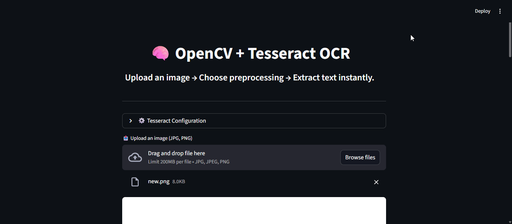

<h1 align="center">🧠 Text Recognition using OpenCV + Tesseract OCR</h1>

<h3 align="center">
A complete computer vision pipeline for image-to-text extraction — powered by OpenCV preprocessing, Tesseract OCR, and Streamlit UI.
</h3>

<p align="center">
  
  
  
  
  
  
</p>

---

## 🧠 Overview

This project demonstrates how to extract text from images using **OpenCV preprocessing** and **Tesseract OCR**, all wrapped in a clean, interactive **Streamlit interface**.

It supports multiple preprocessing modes for improved accuracy, automatically detects Tesseract installations, and provides both **command-line** and **web-based** usage.

Whether it’s reading license plates, scanned documents, or printed text — this project brings the entire OCR process into one seamless workflow.

---

## 📂 Folder Structure

```bash
02_OpenCV_Text_Recognition_and_OCR/
├─ .vscode/
│  └─ settings.json
├─ app/
│  ├─ app.py
│  └─ UI_Overview.gif
├─ raw_scripts/
│  ├─ OCR.py
│  └─ pytessarct.ipynb
├─ sample_images/
│  ├─ 1.png
│  ├─ images.jpg
│  └─ new.png
├─ ocr_text_detection.py
└─ OCR_Text_Recognition.ipynb
```

---

## 🌟 Key Features

| Feature | Description |
|----------|--------------|
| 🧩 **Dual Mode Execution** | Use as CLI script or Streamlit app |
| 🧠 **Automatic Tesseract Detection** | Works on Windows / Linux / macOS |
| 🎛️ **Preprocessing Modes** | Threshold, Adaptive, and Bilateral Smoothing |
| 🖼️ **Live Preview** | Shows both original and processed images |
| 💾 **Downloadable Results** | Save extracted text as `.txt` instantly |
| 🕶️ **Dark Theme Streamlit UI** | Clean, responsive, and elegant design |

---

## ⚙️ Installation & Setup

### 1️⃣ Clone Repository

```bash
git clone https://github.com/mubasshirahmed-3712/FSDS-DeepLearning-Projects.git
cd 04_OpenCV_Computer_Vision/02_OpenCV_Text_Recognition_and_OCR/
```

### 2️⃣ Create Environment & Install Dependencies

```bash
conda create -n ocr_env python=3.10 -y
conda activate ocr_env
pip install opencv-python numpy pytesseract streamlit matplotlib
```

### 3️⃣ Install Tesseract OCR Engine

- **Windows (Recommended):**
  - Download from [UB Mannheim Builds](https://github.com/UB-Mannheim/tesseract/wiki)
  - During installation, check **Add to PATH**
  - Typical path: `C:\Program Files\Tesseract-OCR\tesseract.exe`

- **macOS:**  
  ```bash
  brew install tesseract
  ```

- **Ubuntu/Debian:**  
  ```bash
  sudo apt install tesseract-ocr
  ```

---

## 🚀 How to Run

### 🧾 1️⃣ Command Line (Backend Script)

```bash
python ocr_text_detection.py --image sample_images/images.jpg --mode thresh --save
```

- `--mode` options → `thresh`, `adaptive`, `smooth`
- `--save` → saves text output to `.txt`

### 💻 2️⃣ Streamlit App (Front-End)

```bash
cd app
streamlit run app.py
```

Then open your browser at [http://localhost:8501](http://localhost:8501)

---

## 🎥 Demo — App Interface

<p align="center">
  
</p>

> Upload → Choose mode → Extract → Download 💫

---

## 🧠 Tech Stack

| Component | Role |
|------------|------|
| 🐍 **Python 3.10+** | Base programming language |
| 🧩 **OpenCV** | Image preprocessing & filtering |
| 🔤 **Tesseract OCR** | Optical Character Recognition |
| 🎨 **Streamlit** | Interactive front-end web app |
| 🧮 **NumPy** | Array operations & image handling |

---

## 🧾 System Requirements

| Component | Minimum Requirement |
|------------|----------------------|
| 💻 **OS** | Windows / macOS / Linux |
| 🐍 **Python** | 3.8+ |
| 🧠 **RAM** | 4 GB+ |
| 📸 **Input** | Image files (JPG, PNG) |
| ⚡ **Libraries** | OpenCV, PyTesseract, Streamlit |

---

## 📚 Learnings & Takeaways

- Understanding OCR pipelines (OpenCV → Tesseract)
- Image preprocessing for text clarity
- Real-time visualization via Streamlit
- Text extraction accuracy tuning (PSM modes)
- Modular project structuring for data science repos

---

## 👨‍💻 Developer

**Mubasshir Ahmed**  
🎓 Full Stack Data Science | Deep Learning & Computer Vision  
🔗 [GitHub](https://github.com/mubasshirahmed-3712)

---

## 📜 License

This project is released under the **MIT License** — free to use, modify, and share with attribution.

---

<h3 align="center">✨ “From pixels to paragraphs — turning vision into words.” ✨</h3>
